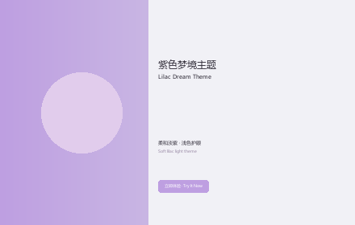

# Lilac Dream Theme

> A soft lilac pastel light theme for Visual Studio Code.
> 一款柔和淡紫梦幻风格的 VS Code 浅色主题。

## Preview · 预览



## Palette · 色板

| Role 用途        | Color 颜色 |
| ---------------- | ---------- |
| Background 背景  | `#F1F1F6` |
| Side Bar 侧边栏  | `#F8F8FC` |
| Accent 强调      | `#BE9FE1` |
| Hover 悬停       | `#C9B6E4` |
| Selection 选区  | `#E1CCEC` |
| Foreground 正文  | `#2E2A36` |
| Comment 注释     | `#9B8CA7` |

## Install · 安装

### From Marketplace · 从插件市场安装

1. Open the Extensions view (`Ctrl+Shift+X`).
2. Search for **Lilac Dream Theme**.
3. Click **Install**, then select **Lilac Dream** from `File > Preferences > Color Theme`.

### From VSIX · 从本地包安装

1. Download `lilac-dream-theme-1.0.0.vsix`.
2. Run `code --install-extension lilac-dream-theme-1.0.0.vsix`.
3. Select the theme as above.

## Features · 特性

- Soft lilac pastel palette with high readability.
- Full UI token coverage: activity bar, side bar, status bar, tabs, lists, inputs, scrollbars, diff, terminal.
- Carefully tuned syntax colors for comments, strings, keywords, functions, numbers and operators.
- Designed for light environments, easy on the eyes for long coding sessions.
- 完整的界面配色覆盖，语法高亮柔和清晰，适合长时间浅色环境编码。

## Recommended Settings · 推荐设置

```json
{
  "workbench.colorTheme": "Lilac Dream"
}
```

## License · 许可证

Non-Commercial License. See [LICENSE.md](LICENSE.md) for details.
非商业使用许可证，详见 LICENSE.md。
