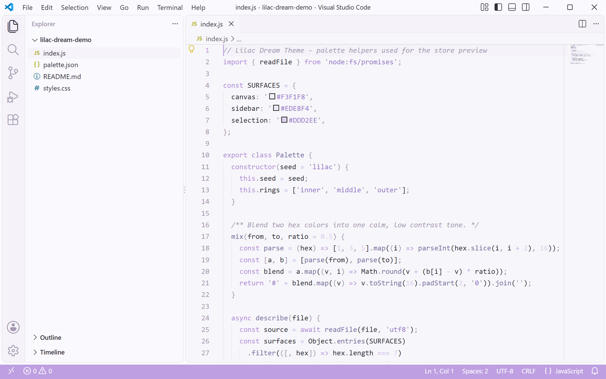
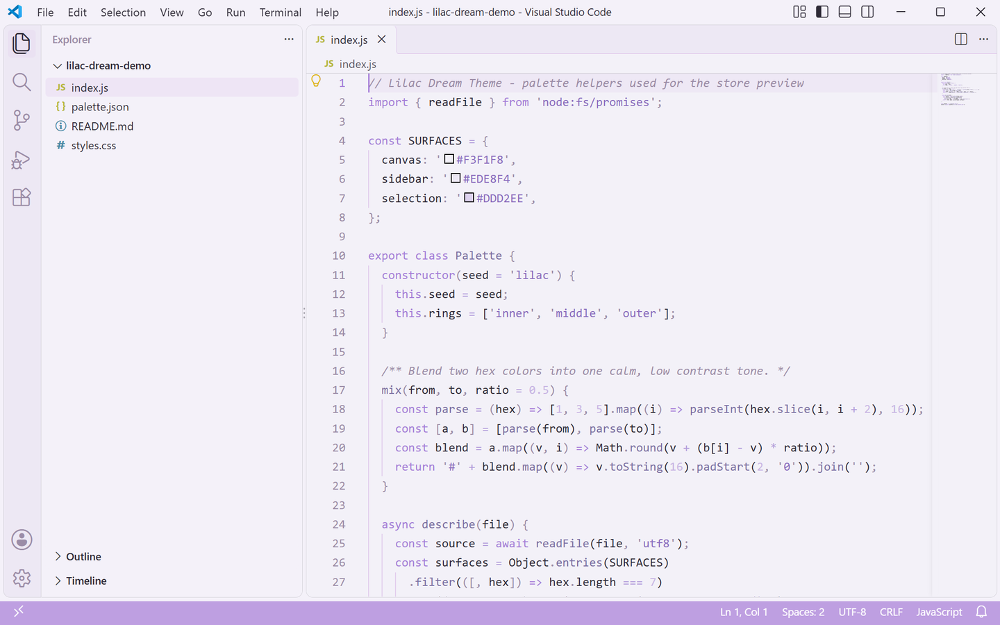
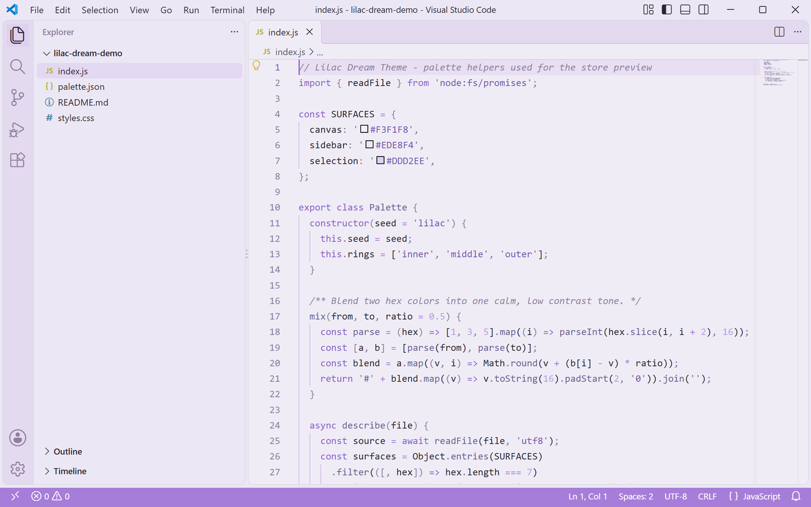
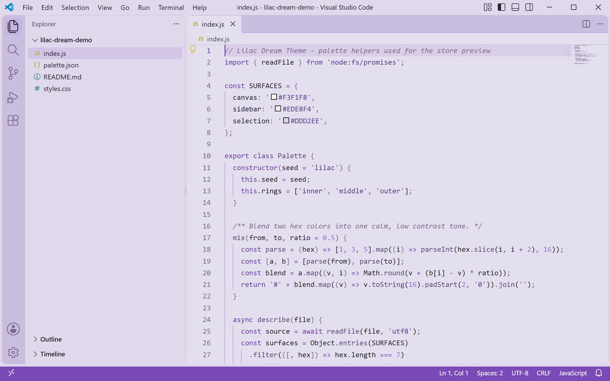
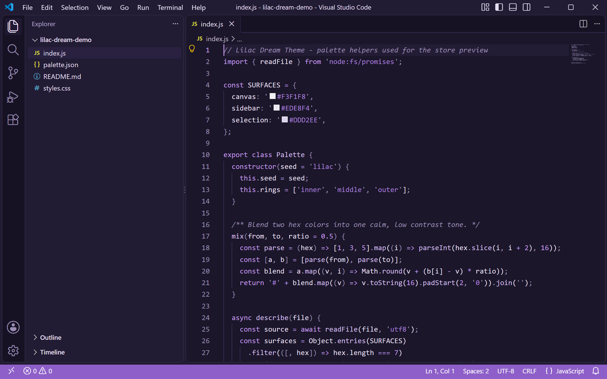

<p align="center">
  
</p>

<h1 align="center">Lilac Dream Theme</h1>

<p align="center">
  <a href="https://marketplace.visualstudio.com/items?itemName=lilinhuang.lilac-dream-theme">
    
  </a>
</p>

一款以淡紫色为主调的柔和 VS Code 主题家族，包含五档明度变体：从最轻盈的晨薰（Dawn）到深邃的夜薰（Night）。

A soft purple-toned VS Code theme family with five brightness variants, from the airy **Dawn** to the deep **Night**.

## 主题变体 / Theme Variants

| 中文名 | 英文名 | 风格 |
|--------|--------|------|
| 晨薰 | Dawn | 最浅最轻盈 / Lightest & airy |
| 梦薰 | Dream | 基准浅色 / Base light |
| 盛薰 | Bloom | 中等饱和浅色 / Saturated light |
| 暮薰 | Dusk | 最深浅色 / Deepest light |
| 夜薰 | Night | 深色模式 / Dark mode |

## 变体预览 / Variant Previews

以下截图均为真实 VS Code 窗口实拍。

All screenshots below are captured from a real VS Code window.

### Lilac Dawn · 晨薰

最轻盈的浅色，近白底配极淡紫晕，适合白天强光环境。

The lightest variant — near-white surfaces with a faint lilac glow.



### Lilac Dream · 梦薰

基准浅色，淡紫骨架最均衡，日常编码的默认推荐。

The base light theme with a balanced lilac chrome — the default pick.



### Lilac Bloom · 盛薰

中等饱和浅色，紫意更明显，界面层次更分明。

Medium-saturation light theme where the lilac reads more clearly.



### Lilac Dusk · 暮薰

最深的浅色，暮色渐浓，长时间夜读护眼柔和。

The deepest light variant — lilac at dusk, gentle for long sessions.



### Lilac Night · 夜薰

深色模式，深紫夜幕配高对比代码配色。

Dark mode — a deep lilac night with bright, readable code colors.



## 安装 / Installation

1. 在 VS Code 扩展市场搜索 **"Lilac Dream Theme"**。
2. 点击安装。
3. 打开命令面板（`Ctrl+Shift+P` / `Cmd+Shift+P`），输入 **"Color Theme"**，选择你喜欢的 Lilac 变体。

Or install from the [VS Code Marketplace](https://marketplace.visualstudio.com/).

## 特性 / Features

- 五款明度梯度，覆盖浅色到深色需求
- 统一淡紫骨架，视觉一致柔和
- 完整界面配色（编辑器、侧边栏、状态栏、终端、diff 等）
- 为中文界面优化的舒适对比度
- 配套终端 ANSI 调色板

- Five brightness levels from light to dark
- Unified lilac chrome for visual consistency
- Full UI token coverage (editor, sidebar, status bar, terminal, diff, etc.)
- Comfortable contrast tuned for daily coding
- Matching terminal ANSI palette

## 推荐搭配 / Recommended Settings

```json
{
  "editor.fontSize": 14,
  "editor.lineHeight": 26,
  "workbench.tree.indent": 16
}
```

## 许可 / License

[Non-Commercial License](LICENSE.md)

免费用于个人学习、研究与非商业项目；商业用途请联系作者获取授权。

Free for personal learning, research, and non-commercial projects. Commercial use requires permission.

## 致谢 / Credits

Designed with 💜 by Li Lin Huang.
